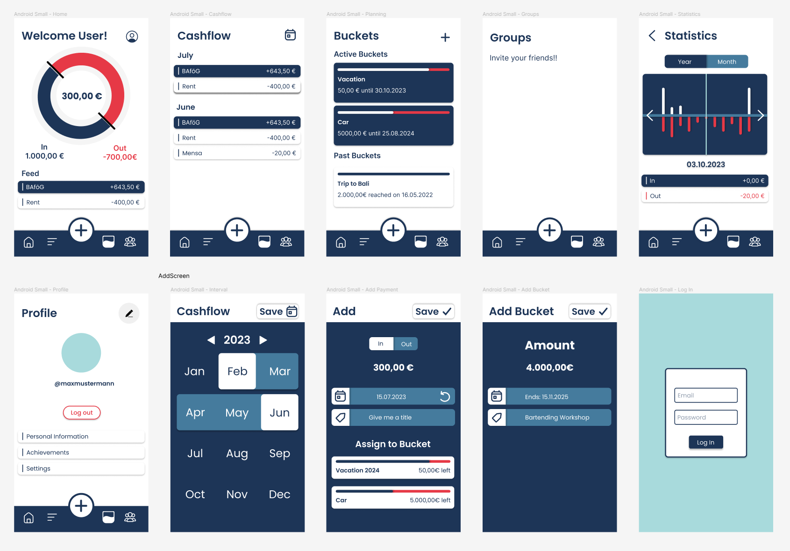
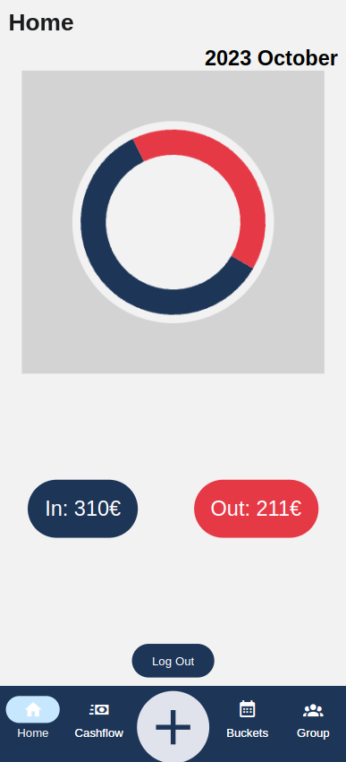

# Blogpost Web Development Group 1 - Studibucket Project

## Introduction

Our project is a budgeting mobile app for students to manage their finances and to make economical plans. In modern time, it could be excruciatingly difficult for students to track their daily expences and make future saving plans. Our mobile app solves this problem in that it allows users to organise and monitor their income streams, expences and savings by employing "buckets", hence the name Studibucket. Buckets are analogical to piggy banks, which could be dynamically allocated to proportions of income and expenditure to facilitate making financial decision, such as vacations, laptops etc...

## Method

In the beginning, we chose the React Native framework to build our mobile app for the reason of having learned the popular React.js framework in the learning phase of the TechLabs bootcamp and unlike other mobile app frameworks such as Flutter or Svelte, considerably major amount knowledge of React.js can be carried over in mobile app development which makes it highly practical for us students to extend our knowledge in frontend web development. Typescript is chosen because of the type safety and debugging comfort it provides.

The Expo SDK was our sandbox of choise to easily emulate our app in real time and debug it on the browser during development. As for the backend, we chosed Firebase Firestore for database and Auth for user authentication because of its straitforward useage, security handling and easily understandable documentation.

We chose prominent popular Zustand for state management because of its relatively less boiler plate code and easy learning curve.

- Step 0: React and TS Workshops with the mentors
- Step 1: Setting up the work environment (installations of frameworks and libraries, VS Code configurations, emulator, Firebase account)
- Step 2: Concept and workflow design on Excalidraw
- Step 3: Design of the frontend and themening in Figma
- Step 4: Starting the basic coding of pages
- Step 5: Test of backend connection of Firestore and Auth
- Step 6: Implemention of frontend with thememing
- Step 7: Connecting the Firestore and Auth with the frontend code
- Step 8: Adding finishing touches and testing

### Review of the tools and frameworks in detail

TypeScript, chosen for Studibucket, enhances code quality by adding static typing to JavaScript. This ensures early error detection, reducing runtime bugs and improving maintainability. However, TypeScript might require a slight learning curve, especially for developers new to static typing. Overall, it's a valuable tool for robust and scalable app development.

React Native offered several advantages for our project. It facilitated code reusability between the web and mobile app, reducing development time and effort. The framework benefits from a large and active community, providing access to a wealth of libraries, tools, and resources. Additionally, React Native allowed us to target both iOS and Android platforms simultaneously.

On the downside, React Native had some limitations, particularly in handling complex native features. While it supported native module integration, intricate native functionalities might require custom native code. Additionally, for graphics-intensive applications, performance could be a concern.

To streamline development and testing, we relied on the Expo SDK, which provided real-time emulation and browser-based debugging. Expo simplified the development process, allowing us to focus on building features rather than dealing with complex configurations. This approach expedited our development process and enabled us to deliver a robust app.

However, Expo did have its limitations. It offered limited customization options, which could be restrictive for projects requiring extensive custom native module integration and low-level configurations.

For the backend, Firebase Firestore served as our database, offering straightforward usage, robust security handling, and well-documented features. Firebase Auth was chosen for user authentication, ensuring a secure and user-friendly experience. Firebase provided real-time database synchronization, scalability, and versatile authentication methods. Nevertheless, it had vendor lock-in concerns due to its association with Google and some limitations in handling complex queries.

In terms of state management, we opted for Zustand due to its efficiency in reducing boilerplate code and its gentle learning curve, making it a suitable choice for our student project. Zustand's minimal boilerplate code and simplicity made it an ideal fit for our application. However, it had a smaller community compared to larger state management solutions like Redux.

## Project Result

The Studibucket app has emerged as a powerful tool for students seeking to manage their finances effectively. With a user-friendly interface, the app allows users to create and allocate "buckets" for various expenses and savings goals, mirroring the concept of traditional piggy banks. The project resulted in a robust mobile app that simplifies financial decision-making for students.
The users are greeted by a warm login screen which then transports them to the homepage which has a doughnut chart showing the total income and outcome. From there, the user has access to several pages. The Cashflow page allows the users to monitor their past cashflow. The buckets page contains the user's buckets, both past an present.Each bucket encompasses its current savings and the date of the bucket's maturing. This page also allows users to create new buckets. The add button allows inputting income and expenses as well as which bucket they go into.

## Conclusion

In conclusion, our journey with the Studibucket project has been both educational and rewarding. We have successfully developed a budgeting mobile app that addresses the financial challenges faced by students today. Our choice of technologies, including React Native, TypeScript, Expo SDK, Firebase Firestore, and Zustand, has proven to be effective in achieving our project goals.

### Future Work/Outlook

As we look ahead, there are several exciting avenues for further improvement and expansion of the Studibucket app. Our most prominent future goal is to make the app more community-oriented, fostering collaboration among users. We envision an option that allows flatmates to connect and create collaborative buckets for tracking shared expenses, such as groceries and bills. Additionally, we plan to introduce a forum page where users can share information about local sales and discounts, further enhancing their ability to save money.

In addition to these community-focused enhancements, we have other key future plans:

Expense Tracking Graphs: We aim to provide users with detailed expense tracking graphs, enabling them to visualize their spending habits over time and make informed financial decisions.

Personalized Financial Tips: Incorporating machine learning algorithms will allow us to offer personalized financial recommendations to users, helping them make smarter financial choices.

Cross-Platform Compatibility: We intend to expand the app's compatibility to reach a broader audience, ensuring that both iOS and Android users can benefit from Studibucket.

Enhanced Security: Strengthening security measures and user data protection will remain a top priority to ensure a safe and secure user experience.

Financial Literacy Promotion: Collaborating with educational institutions to promote financial literacy among students is a crucial part of our long-term vision. We aim to empower students with the knowledge and tools they need to make informed financial decisions.

The Studibucket project has the potential to revolutionize how students manage their finances, and we are excited to continue its development journey. Thank you for joining us on this adventure, and we look forward to the future of Studibucket.
