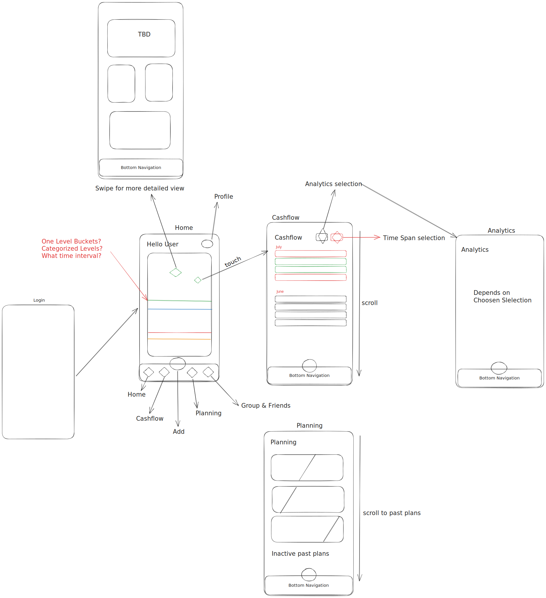

# Studibucket

Studibucket is a mobile app that helps you to manage your personal finance!
We enable students to collectively save money. 

**We make the world a better place**

## Features

- Manage Money
  - Adding, Editing Income & Expenses 
  - Categorization (Buckets) of Cashflows (Income&Expenses)
  - Journaling / History of cashflows 
  - Recurring / periodic Cashflows
- Planning
  - Budgeting future flows (on categories)
- Analysis
  - Surplus of period
  - Average Income / Expense for period
  - Total Spending, Income
  - Spending, Income per category 
  - Timeline of Spending, Income
  - "Cool statistics"
- Group Cashflows
  - Manage Money as group (with other users)
  - Friend Adding / Group System 
- Localization
  - anonym local chat to share money saving opportunities
- Gamification
  - Achievements, Streaks (single Person + groups)
  - Quests, Daily, Weekly tasks (single Person + groups)
- OCR (Machine Learning)
  - scanning bills, codes to automatically add to managed expenses

## Road to v1.0.0

We have in total **12 weeks**.

1. Manage Money (week: 0-2)
2. Analysis (week: 2-4) 
3. Planning (week: 4-6)
4. Group cashflows (week: 6-9)
5. Gamification (week: 9-11)
6. Localization / OCR (week: 11-12)

MVP: Manage Money, Analysis, Planning

## Team

- @Hannachan105: React, UX, Firebase basic = "React"
- @melek16: React, Firebase, UX basics = "React"
- @Aserhisham: UX, React, Firebase basics = "Data, Firebase"
- @msezai: React, Firebase = "React, Firebase"

